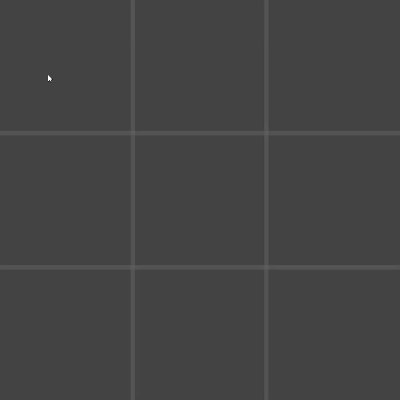
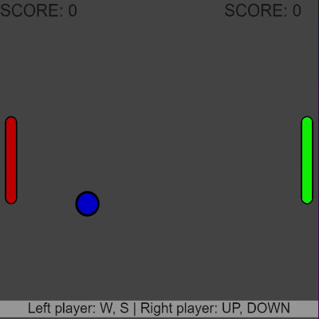

# p5.js Projects
This is a repo that summarizes my p5.js projects. <a href="https://p5js.org/">p5.js</a> is a `JavaScript` library for creative coding and interactive graphics. 

For each project, I have attached the corresponding GitHub repo and also the link to the GitHub page where you can play the game.

David Norman Díaz Estrada 
https://www.linkedin.com/in/dnde7/  

------------------
 **Tic Tac Toe**  
------------------
I started coding the classic Tic Tac Toe game. 
Repo/code: https://github.com/DavidDZ7/tictactoe  
Play here: https://daviddz7.github.io/tictactoe/

------------------
 **Pong**  
------------------

Then I implemented the Pong game. 
Repo/code: https://github.com/DavidDZ7/pong  
Play here: https://daviddz7.github.io/pong/

Use `W` and `S` for the left player, and `UP` and `DOWN` for the right player. 
You can adjust the window size, the ball's speed increases with the window width.

------------------
 **Breakout**  
------------------
After Pong, I decided to code the Breakout game. 
Repo/code: https://github.com/DavidDZ7/breakout  
Play here: https://daviddz7.github.io/breakout/

Use the `RIGHT` and `LEFT` keys. 

------------------
 **Special Thanks**  
------------------
<ul>
  <li> <a href="https://p5js.org/">p5.js</a> for being the coolest JavaScript library for creative coding</li>
  <li> <a href="https://thecodingtrain.com/">Daniel Shiffman</a>, for all his remarkable educational contributions and for sparking my passion for creative coding.</li>
</ul>
